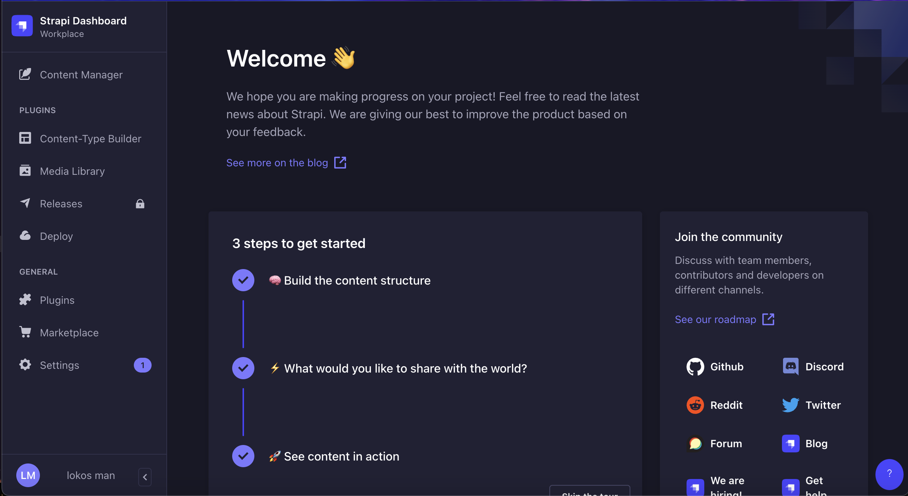
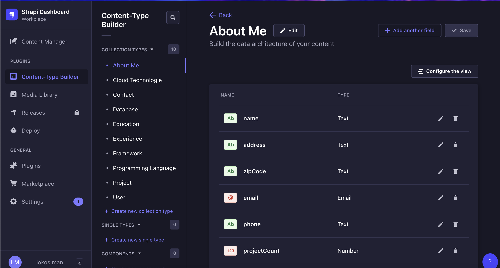

# 🚀 Portfolio Project Backend




This is the backend for my portfolio project, built using Strapi CMS. It manages content such as projects, about me, resume details, and contact messages.

## Getting Started

### `develop`

Start your Strapi application with autoReload enabled. [Learn more](https://docs.strapi.io/dev-docs/cli#strapi-develop)

```
npm run develop
# or
yarn develop
```

### `start`

Start your Strapi application with autoReload disabled. [Learn more](https://docs.strapi.io/dev-docs/cli#strapi-start)

```
npm run start
# or
yarn start
```

### `build`

Build your admin panel. [Learn more](https://docs.strapi.io/dev-docs/cli#strapi-build)

## Contact

For any inquiries, please reach out to me via the contact form on the portfolio or through my email: [lokosman5@gmail.com](mailto:lokosman5@gmail.com).

## License

This project is licensed under the MIT License.